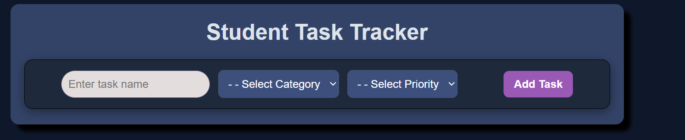
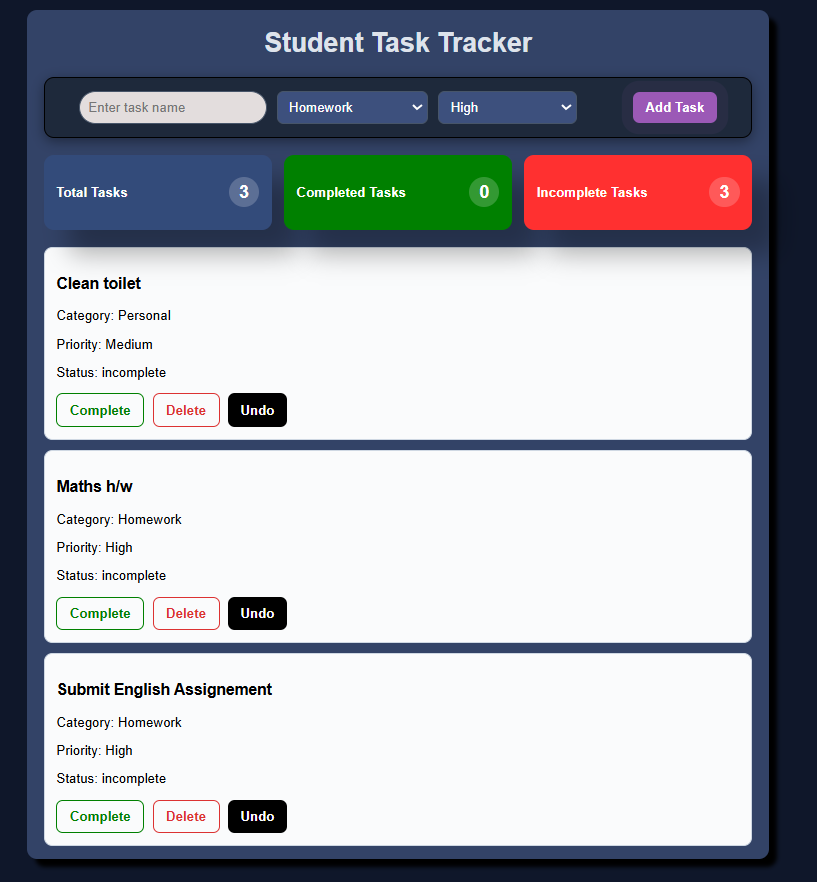
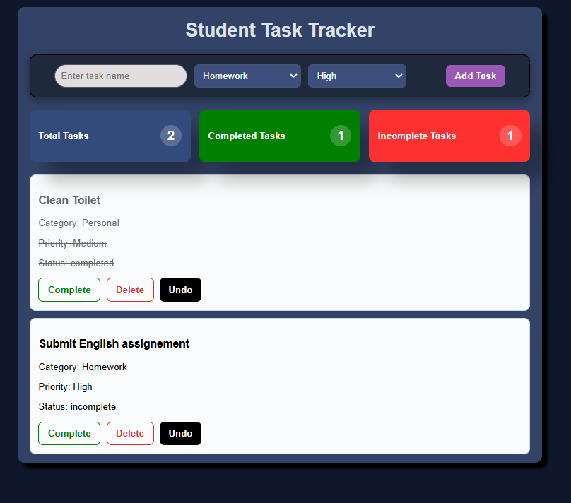
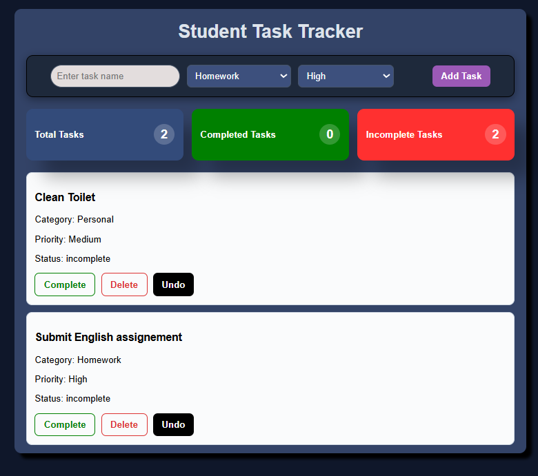

# 📝 Student Task Tracker

A simple task management web app built using HTML, CSS, and JavaScript.  
It allows students to add, complete, undo, and delete tasks while tracking progress in real time.

---

## 🌐 Live Demo

The project is live here:  
👉 https://gaurav-wb.github.io/Student-Task-Tracker/

---

## 🚀 Features

- Add new tasks with category and priority
- Mark tasks as completed
- Undo completed tasks
- Delete tasks permanently
- Live summary dashboard:
  - Total tasks
  - Completed tasks
  - Incomplete tasks
- Clean responsive UI

---

## 🛠️ Tech Stack

- HTML5
- CSS3 (Flexbox + Animations)
- JavaScript 

---

## 📸 Demo Screenshots

### 🟢 Start UI
 

### ✅ Complete Task

### ↩️ Undo Task

### ❌ Delete Task

---

